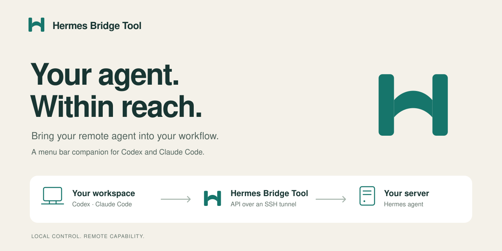

# Hermes Bridge Tool

**Give your coding agent a direct line to your remote Hermes agent.**

Browse your server's Hermes conversations from Codex or Claude Code, send messages
to new or existing chats, and wait for remote tasks to finish. It wraps the existing WebUI API, Gateway API, and native Hermes MCP server.
Connect over HTTPS or SSH, with an optional icon-only macOS menu bar companion.

[Choose a backend](docs/BACKENDS.md) · [Get started](#install-and-pair) · [Sessions and monitoring](docs/SESSIONS.md) · [Setup details](docs/SETUP.md) · [Harnesses](docs/PLUGINS.md) · [Brand assets](docs/BRAND.md)

Hermes Bridge Tool is the provisional project name. See the [rename notes](docs/SETUP.md#moving-from-the-provisional-name) if you installed the earlier Hermes Bridge version.

## Choose what to connect

| You want to… | Use |
| --- | --- |
| Continue browser chats and monitor browser-started tasks | **WebUI API** (`hermes_webui_*`) |
| Delegate tasks through the Gateway | **Gateway API** (`hermes_send`, `hermes_wait`, etc.) |
| Read platform conversations or deliver authorized messages | **Native Hermes MCP** (`hermes_native_*`) |
| Monitor independently started CLI turns | **Optional observer** (`hermes_turns`, `hermes_wait_turn`) |

Agents call `hermes_backends` first. Tool descriptions explain ownership, IDs,
completion evidence, and when each interface applies. They never need to guess
whether a browser stream ID is a Gateway run ID.

If you already have a WebUI, install locally without changing the server:

```sh
./install.sh --no-setup
hermes-bridge-tool configure-webui --url https://your-webui.example
hermes-bridge-tool register both
hermes-bridge-tool doctor --backend webui
```

The command privately prompts for the WebUI login cookie. Use `--ssh --host hetzner`
instead of `--url` for a server-only WebUI. Direct HTTPS needs no SSH tunnel.
See [backend setup and agent workflows](docs/BACKENDS.md) for authentication,
native MCP setup, and monitoring examples. The Gateway pairing route follows.

## Install and pair

Clone this repository, enter its directory, and run:

```sh
./install.sh --observe-sessions
```

The installer installs the CLI for your user and builds the macOS companion when
Apple's Command Line Tools are available. It offers to install `uv` if needed.
The guided setup then asks for your SSH host, the Linux user running Hermes, and
which coding clients to connect. `--observe-sessions` also installs the server
observer for CLI turn completion; use `--setup` for the native API tools alone.

**Pairing handles the server configuration for you:** it enables Hermes's
localhost API, preserves or creates its key, restarts the standard gateway,
checks compatibility, and saves the key privately on your machine over SSH.
You do not need to paste credentials between machines.

Open **Hermes Bridge Tool** from `~/Applications`, choose **Connect**, and restart your
coding client. Ask it:

> Check Hermes, then ask it to reply “Bridge connected” without using tools.
> Wait for its result and show me the reply.

Already installed? Run `hermes-bridge-tool setup` or choose **Set up connection…** in
the menu bar. For a Linux/CLI-only install:

```sh
./install.sh --no-app --observe-sessions
hermes-bridge-tool tunnel
```

### What you need

- A Linux server with [Hermes installed and configured](https://hermes-agent.nousresearch.com/docs/getting-started/installation/), including a working model provider.
- For SSH connections: key/agent access with the host key already verified.
- For direct HTTPS: an existing endpoint and its accepted authentication.
- macOS 13+ for the menu bar app, or macOS/Linux for the CLI.
- Xcode Command Line Tools to build the Mac app from source (`xcode-select --install`).

The wizard configures an existing Hermes gateway. It does not install or upgrade
the agent itself. Custom service managers and Docker setups use the
[manual setup path](docs/SETUP.md#custom-services-and-manual-setup).

## What it does

| From your coding agent | Hermes Bridge Tool |
| --- | --- |
| “Find my recent Hermes CLI or web UI chats.” | Lists saved sessions and reads their messages. |
| “Start a new chat about the server logs.” | Creates a conversation and submits instructions. |
| “Continue that conversation.” | Starts a new turn using its saved transcript. |
| “Wait for that task to finish.” | Polls a known run and returns its state and output. |
| “Watch this existing chat for updates.” | Watches saved messages for changes. |
| “Monitor this CLI turn until it finishes.” | Tracks lifecycle events with the optional server observer. |
| “Tell the running task to focus on today's logs.” | Steers a known run when the gateway supports it. |
| “Stop that task.” | Requests interruption and checks the resulting state. |

The 13 Gateway and observer tools remain available alongside 10 WebUI tools,
three native MCP wrappers, and the `hermes_backends` routing guide (27 total):

| Purpose | Tools |
| --- | --- |
| Connection and capabilities | `hermes_check` |
| Browse conversations | `hermes_sessions`, `hermes_session`, `hermes_messages` |
| Start or continue a chat | `hermes_new_chat`, `hermes_send` |
| Monitor work | `hermes_status`, `hermes_wait`, `hermes_watch_session` |
| Observe CLI and web UI turns | `hermes_turns`, `hermes_wait_turn` |
| Guide or stop a running task | `hermes_steer`, `hermes_stop` |

Sessions come from the connected server profile, including Hermes CLI and web UI
history saved there. API tasks use a **run ID** for completion monitoring. To
observe CLI and web UI turn lifecycle events on an existing installation, add
the optional server plugin (the install command above already includes it):

```sh
hermes-bridge-tool setup --observe-sessions
```

Reopen existing remote CLI processes so they load the plugin. It records new
turns from lifecycle hooks and serves metadata through the existing gateway;
missing finish events remain unknown. Continuing a CLI session starts a gateway
turn using its transcript. See [sessions and monitoring](docs/SESSIONS.md) for
examples and the limits of live terminal access.

```text
Codex / Claude Code → local MCP client
                     ├─ HTTPS or SSH → existing WebUI API
                     ├─ HTTPS or SSH → existing Gateway API (+ optional observer)
                     └─ local process or SSH → native hermes mcp serve
```

Each harness starts its own MCP process. The menu bar app owns the shared SSH
tunnel; browsing and messaging happen through your coding client's tools. The
installed CLI and app work independently of the source checkout.
Hermes executes instructions with its server-side tools, settings, and permissions.

Read local prompt files before sending their contents: the remote agent cannot
read laptop paths. Save run IDs and final output; Hermes retains completed run
status only temporarily. For Gateway submissions, retry with the same `request_id` and identical inputs.
WebUI and native writes have no such guarantee; inspect state before retrying. Disconnecting the tunnel does not cancel accepted work;
stopping a run does not undo earlier actions. Resolve pending approvals in Hermes.

## A small, inspectable project

| Component | Where |
| --- | --- |
| Python CLI, MCP tools, SSH pairing | `src/hermes_bridge_tool/` |
| Native Swift/AppKit companion | `macos/` |
| Codex and Claude Code plugin manifests | `.codex-plugin/`, `.claude-plugin/` |
| Editable logo and app artwork | `assets/brand/` |
| Mock API, installer, and pairing tests | `tests/` |

Settings live in `~/.config/hermes-bridge-tool/config.json`; the key is a separate
private file. No account with Hermes Bridge Tool, public port, or hosted relay is
required. See [setup details](docs/SETUP.md) for profiles, ports, migration, and
troubleshooting.

## Develop and share

```sh
uv sync --locked
uv run python -m unittest discover -s tests -v
sh tests/test_install.sh
./scripts/build-macos.sh  # macOS
```

[Contributing](CONTRIBUTING.md) explains the development loop.
[Release instructions](docs/RELEASING.md) cover pushing your repository, creating
artifacts, and drafting a GitHub release. The Mac app is currently ad hoc signed;
a public notarized release needs an Apple Developer signing identity.

Independent open-source companion; not an official Nous Research, OpenAI, or
Anthropic product. MIT licensed. Original bridge code came from Monemetrics;
see [LICENSE](LICENSE).
